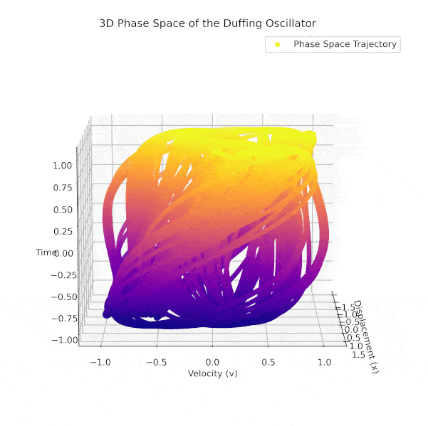

# Leveraging Koopman Operators and Deep Neural Networks for Duffing Oscillators (ISAV 2023)

Harnessing Koopman theory and modern deep learning, this repository delivers a full-stack toolkit for **parameter estimation, prediction, and qualitative analysis** of nonlinear Duffing oscillators. Beyond reproducing our ISAV 2023 results, the project ships with curated datasets, reusable model components, visualization dashboards, and automation utilities for exploring rich dynamical regimes—from periodic motion to fully developed chaos.

> 📅 Last major refresh: July 2024 — the project continues to evolve with improved notebooks, richer datasets, and better visualization support.

.png)



---

## Why This Project Stands Out

- **Unified Koopman + Deep Learning Pipeline**: Learn Koopman embeddings, train neural decoders, and perform long-horizon forecasting in one coherent codebase.
- **Rich Dynamical Exploration**: Generate and analyze Duffing trajectories across forcing amplitudes, damping ratios, initial conditions, sampling rates, and noise factors.
- **Visualization Playground**: Produce time-series overlays, 2D/3D phase portraits, Poincaré sections, bifurcation-inspired scans, and publication-ready animations.
- **Research-Grade Assets**: Includes pre-trained weights, metric logs, and scripts to reproduce the experiments from both the ISAV 2023 paper and the extended 2024 journal article.

---

## Project Highlights at a Glance

### 🔍 Dynamical Analysis Suite
- **Time-domain profiling**: Compare displacement, velocity, and acceleration responses for multiple forcing regimes.
- **Phase-plane insights**: Study limit cycles and chaotic attractors via 2D projections (`Duffing_Solution/results/General solution` and `3d phase plane`).
- **3D phase trajectories**: Leverage `PhaseSpace_3d.py` and companion notebooks for interactive exploration of `(x, v, cos(ωt))` embeddings.
- **Poincaré mapping**: Generate dense return maps and animated sweeps (`Duffing_Poincare_Map_Generator.ipynb`, `poncare_scater*.py`) to expose quasi-periodic windows and chaotic seas.
- **Dataset factory**: Systematically synthesize long-horizon trajectories with controlled sampling cadence and metadata-rich filenames for traceability.

### 🧠 Koopman-Infused Deep Learning
- **Encoder–decoder architectures** (`Model/structure.py`, `encoder.py`, `decoder.py`) tailored for Koopman representations.
- **Custom losses** (`Loss/loss_function.py`, `Loss/Koopman_repeat.py`) balancing reconstruction fidelity, Koopman consistency, and regularization.
- **Training engine** (`Deeplearning/Base.py`, `Deeplearning/README.md`) with configuration-driven workflows defined in `config.yaml`.
- **Experiment tracking** via CSV reports and checkpoints stored under `Saved/` for rapid evaluation or fine-tuning.

### 🧰 Utilities & Support Code
- **Numerical solvers**: High-precision Runge-Kutta integrators (`Duffing_Solution/dataloaders/Runge_Kutta.py`) and helper routines (`Duffing_Solution/utils/`).
- **Visualization helpers**: Consistent plotting utilities and animation scripts for consistent figure generation.
- **Configuration management**: A central `Utils/configuration.py` describing datasets, network sizes, optimization parameters, and experiment modes.

---

## Repository Map

- `Duffing_Solution/` — Data generation, numerical solvers, visualization scripts, and an enthusiastic README that doubles as a user manual.
- `Loss/` — Koopman-aligned loss functions and training objectives.
- `Deeplearning/` — Training loops, schedulers, logging hooks, and convenience wrappers.
- `Model/` — Encoder/decoder definitions, Koopman operators, and structural blueprints.
- `Utils/` — Configuration, spectral utilities, metrics, and shared helpers.
- `Saved/` — Pre-trained PyTorch weights, evaluation summaries, and result archives.
- `Images/` — Static figures and animated assets showcased throughout our publications.
- `Train.ipynb` — End-to-end training walkthrough for replicating the flagship experiments.
- `test.py` — Quick sanity check illustrating model loading and short-term forecasting.

Supporting files (`config.yaml`, `directory_tree.txt`, `LICENSE`, and VS Code settings) keep the project reproducible and easy to navigate.

---

## Getting Started

1. **Install dependencies** (Python 3.8+ recommended). We rely on PyTorch ≥ 1.12, NumPy, Matplotlib, tqdm, and related scientific libraries.
2. **Explore datasets** via `Duffing_Dataset_Generator.ipynb` or load precomputed `.npy` files under `Duffing_Solution/datasets/`.
3. **Run training** by launching `Train.ipynb` or executing the scripts in `Deeplearning/` with the provided configuration.
4. **Visualize results** using the notebooks in `Duffing_Solution/` and the plotting utilities under `Utils/`.

For a quick demo, execute `python test.py` to load a saved Koopman model and produce forecast snapshots.

---

## Reproducing the Paper & Extended Experiments

This repository corresponds to:

- **ISAV 2023 conference submission** — The original Koopman-enhanced framework for Duffing oscillators.
- **2024 Journal of Theoretical and Applied Vibration and Acoustics article** — Expanded hyperparameter sweeps, robustness trials, and comparisons against classical estimators.

Use the provided configs and checkpoints in `Saved/` to match the published metrics. Detailed experiment descriptions are available in the subdirectory READMEs.

---

## Citation

If this work supports your research, please cite:

```
@Conference{riyazia2023leveraging,
  title   = {Leveraging Koopman operator and Deep Neural Networks for Parameter Estimation and Future Prediction of Duffing oscillators},
  author  = {Riyazia, Yassin and Ghanbaria, NavidReza and Bahramib, Arash},
  year    = {2023},
  publisher = {ISAV}
}

@article{riyazi2024hybrid,
  title   = {Hybrid Koopman-neural network approach for robust parameter estimation and prediction in Duffing oscillators},
  author  = {Riyazi, Yassin and Ghanbari, Navidreza and Bahrami, Arash},
  journal = {Journal of Theoretical and Applied Vibration and Acoustics},
  volume  = {10},
  number  = {1},
  pages   = {13--28},
  year    = {2024},
  publisher = {Iranian Society of Acoustics and Vibration and Avecina}
}
```

---

## Contact

Questions, comments, or collaboration ideas? Reach out at **iyasiniyasin98@gmail.com**.

We hope this codebase sparks further advances in nonlinear system identification, Koopman-based modeling, and dynamical forecasting. Happy exploring!
